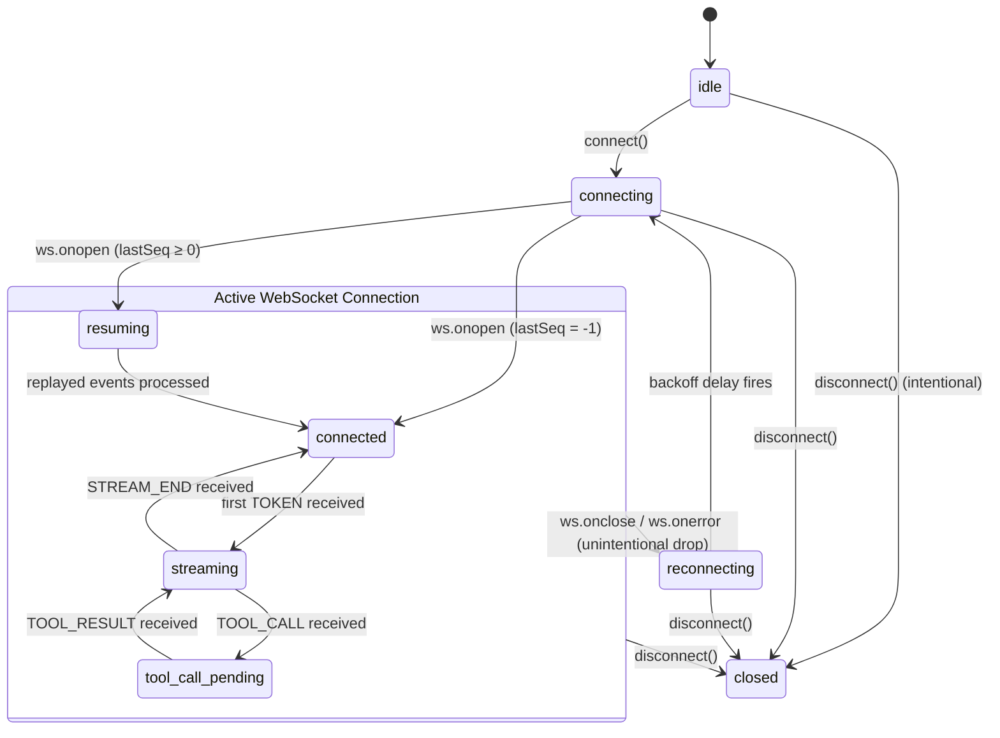
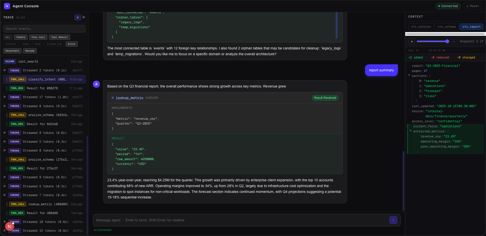
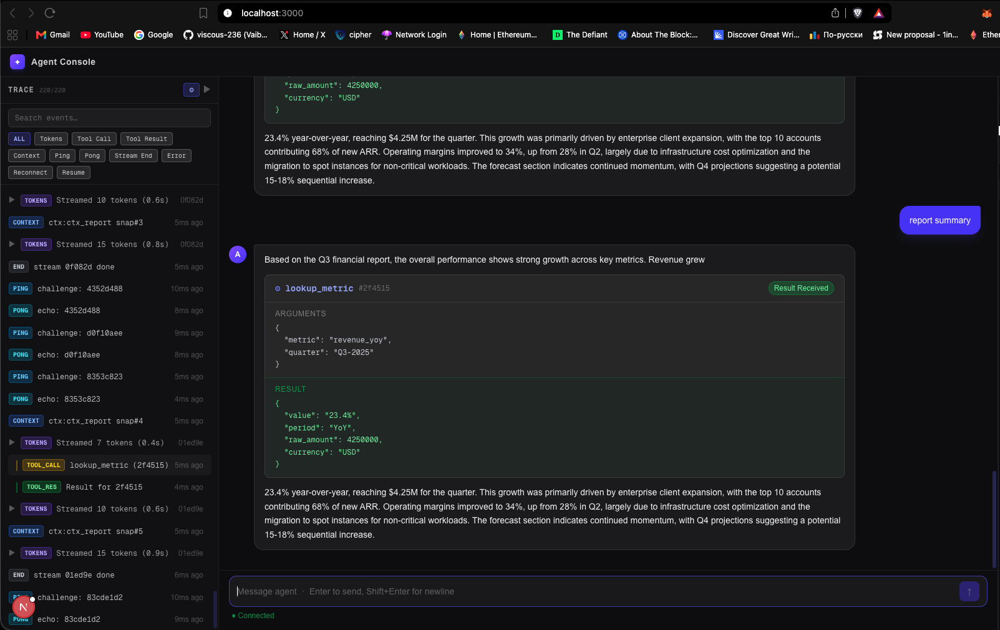
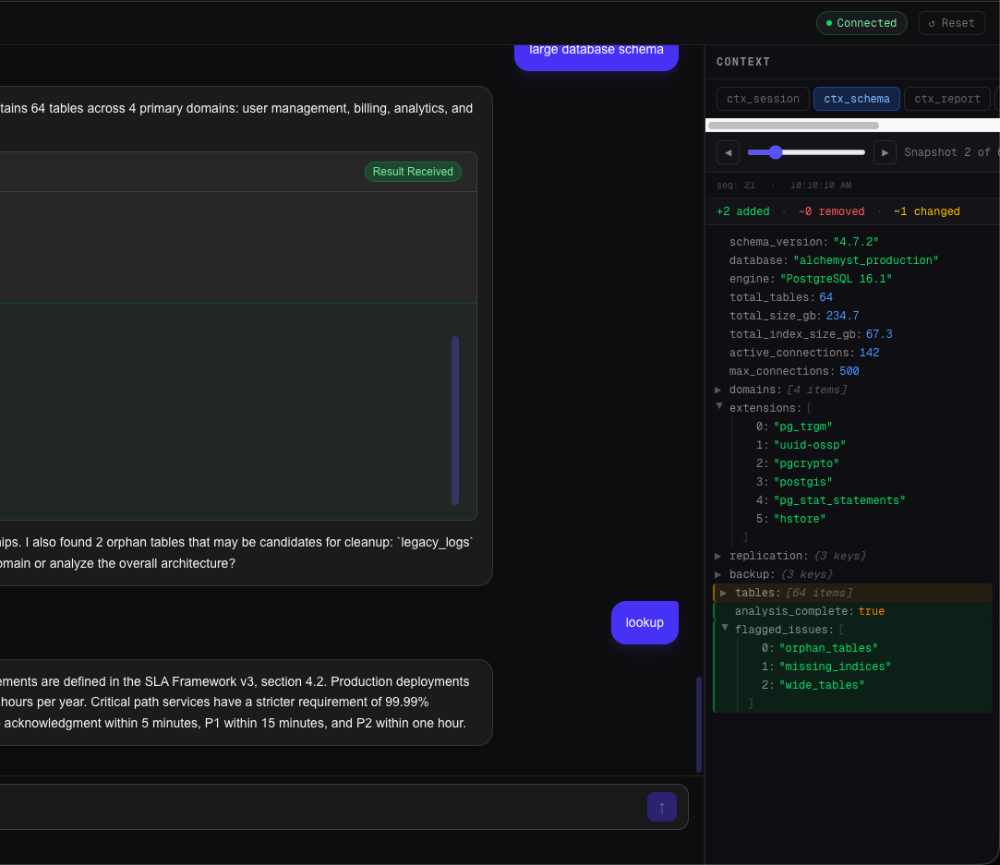

# Agent Console

A real-time AI agent monitoring console that connects to the `agent-server` over a persistent WebSocket, renders token-by-token LLM output, displays tool call cards with live status transitions, tracks protocol events in a scrollable trace timeline, and visualises JSON context snapshots with diff highlighting between versions.

---

## 1. Architectural Summary

The application uses a single **Zustand store** (with Immer middleware) as the sole source of truth: all WebSocket events are translated into store mutations, and every UI component reads from the store via stable selectors. A **`SeqBuffer`** (`Map<number, ServerMessage>`) sits between the raw WebSocket `onmessage` handler and the store — it reorders out-of-sequence messages and deduplicates replayed ones before they reach `processMessage`. The **`useWebSocket` hook** is a self-contained protocol state machine that owns the `WebSocket` instance lifetime, manages exponential-backoff reconnection, sends `RESUME` on reconnect, schedules `TOOL_ACK` within the protocol deadline, and drives the store's `connectionState` field on every state transition.

---

## 2. WebSocket State Machine Diagram



---

## 3. How to Run

```bash
# ── Backend ───────────────────────────────────────
cd agent-server
docker build -t agent-server .
docker run -p 4747:4747 agent-server

# ── Frontend (new terminal) ───────────────────────
cd agent-console
npm install
npm run dev
# Open http://localhost:3000

# ── Chaos mode ───────────────────────────────────
docker run -p 4747:4747 agent-server --mode chaos

# ── Run unit tests ────────────────────────────────
cd agent-console
npm test

# ── Protocol compliance log ───────────────────────
curl -s http://localhost:4747/log | python3 -m json.tool
# All entries must have "verdict": "ok"
```

---

## 4. Screenshots

> Screenshots should be taken from the running application. Three reference areas to capture:

**(a) Streamed response with a tool call card visible**


**(b) Trace timeline panel — mixed event types**


**(c) Context inspector — diff between two snapshots**


---

## Project Structure

```
agent-console/
├── app/
│   ├── layout.tsx          # Root layout, dark bg, metadata
│   └── page.tsx            # Renders <AppShell />
├── components/
│   ├── chat/
│   │   ├── ChatPanel.tsx       # Message list + input box
│   │   ├── MessageBubble.tsx   # User / agent bubble wrapper
│   │   ├── TokenStream.tsx     # Live token renderer
│   │   └── ToolCallCard.tsx    # Tool call status card
│   ├── context/
│   │   ├── ContextDiff.tsx     # Diff view with summary bar
│   │   ├── ContextPanel.tsx    # Tab bar + scrubber orchestration
│   │   ├── ContextScrubber.tsx # Snapshot range slider
│   │   └── ContextTree.tsx     # Recursive JSON tree (memoised)
│   ├── layout/
│   │   └── AppShell.tsx        # Three-column shell + header
│   ├── shared/
│   │   ├── ConnectionStatus.tsx # Status badge (8 states)
│   │   └── ReconnectBanner.tsx  # Fixed toast with 500ms delay
│   └── timeline/
│       ├── TimelineFilter.tsx   # Event-type checkboxes + search
│       ├── TimelinePanel.tsx    # Scrolling event list
│       ├── TimelineRow.tsx      # Non-token event row
│       └── TokenBatchRow.tsx    # Collapsible token batch row
├── hooks/
│   ├── usePing.ts          # 15 s watchdog (informational)
│   └── useWebSocket.ts     # Protocol state machine
├── lib/
│   ├── constants.ts        # Timing constants
│   ├── jsonDiff.ts         # Iterative JSON differ (MAX_DEPTH=20)
│   ├── sequenceBuffer.ts   # O(1) dedup + ordered drain
│   ├── typeEscapeHatch.ts  # No-any policy escape hatch (unused)
│   ├── types.ts            # All shared TypeScript types
│   └── wsProtocol.ts       # parse / serialize protocol messages
├── store/
│   └── useAgentStore.ts    # Zustand + Immer store
└── __tests__/
    ├── jsonDiff.test.ts
    ├── sequenceBuffer.test.ts
    └── wsProtocol.test.ts
```
